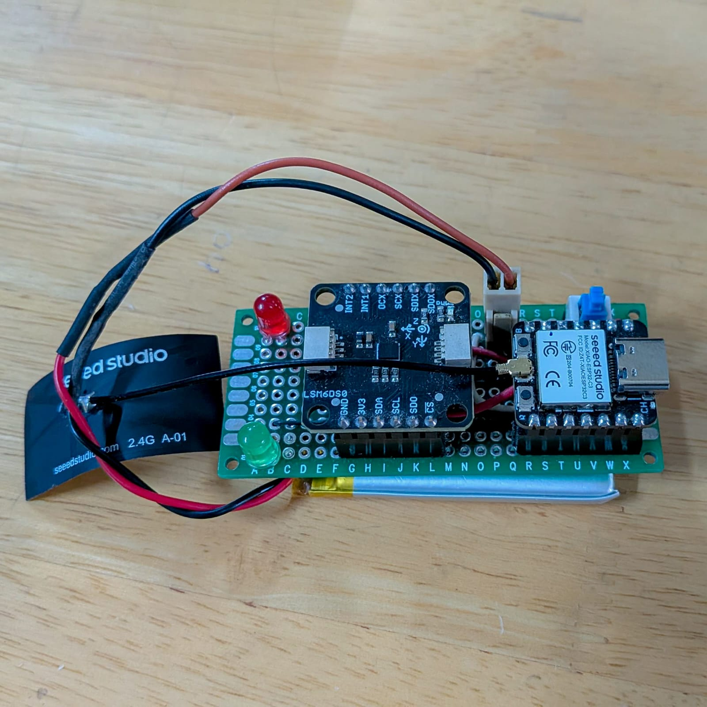
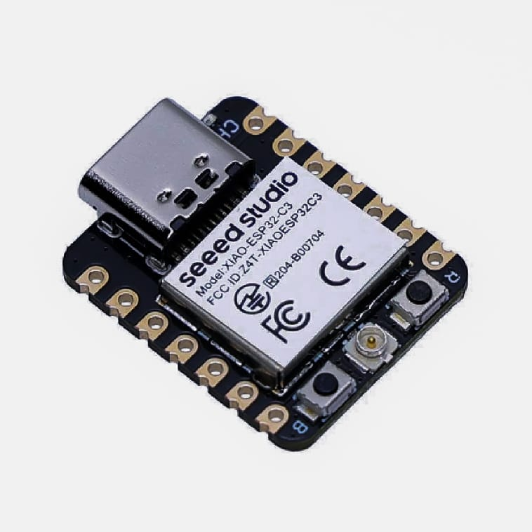
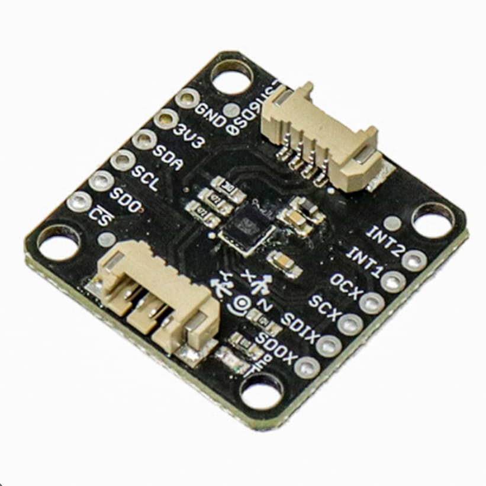
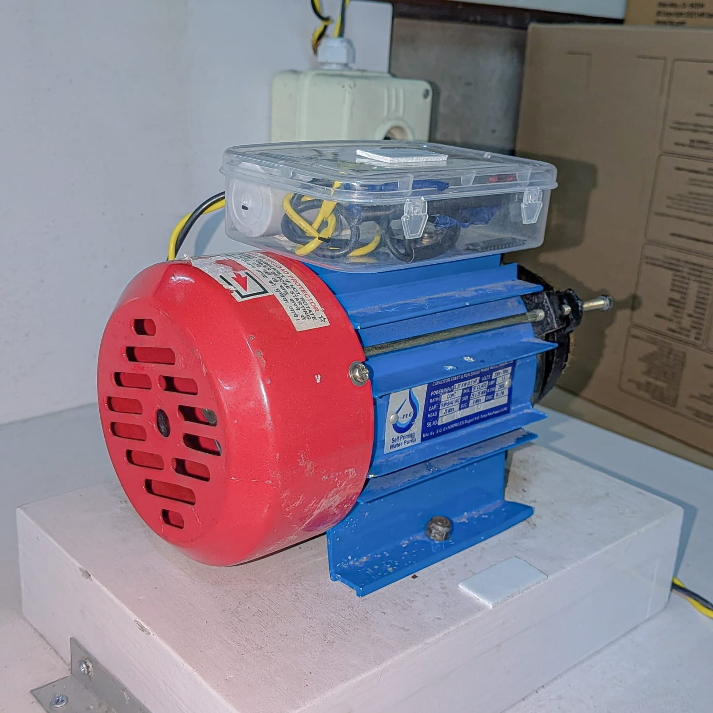
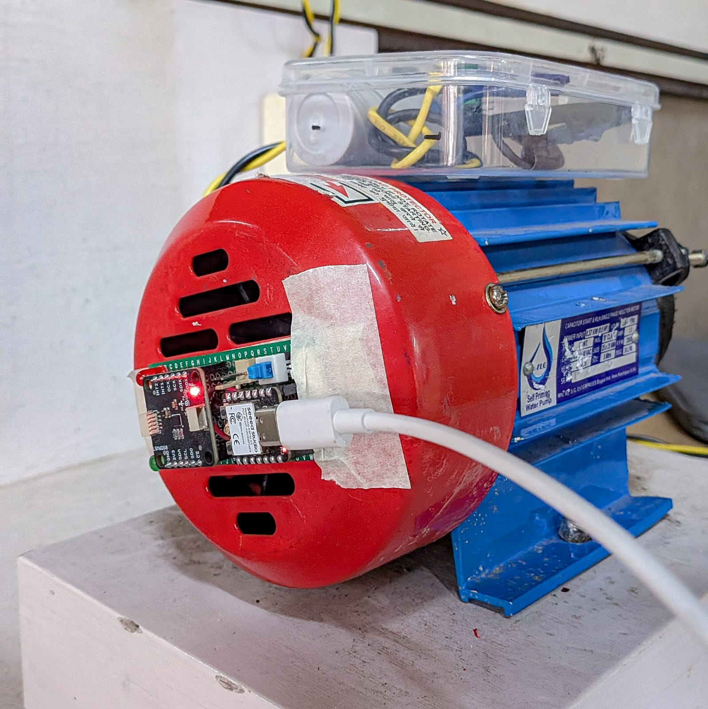
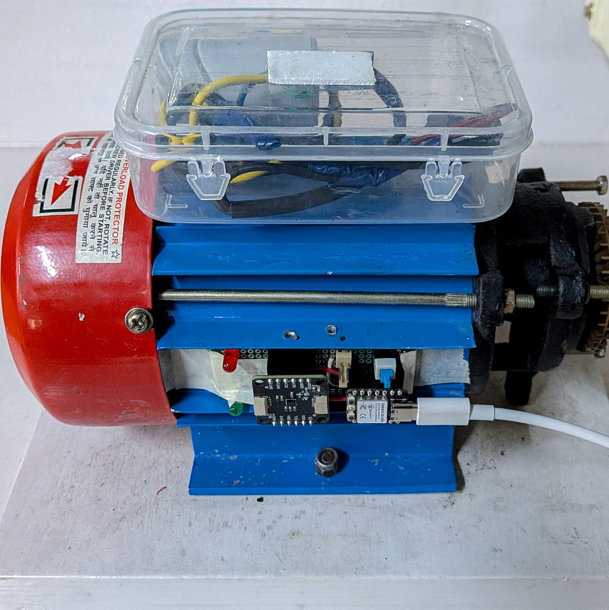
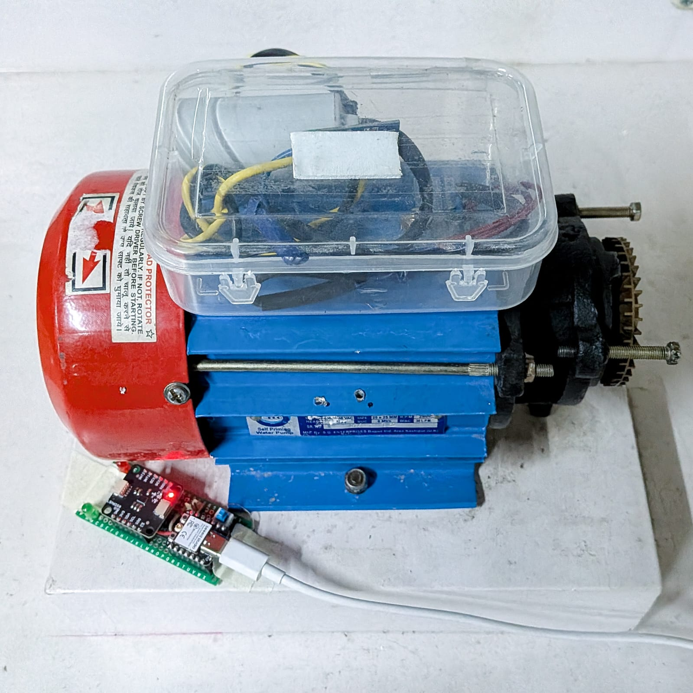

# Vibration Based Mechanical Fault Detection in Industrial Induction Motor using MEMS Sensors and Edge AI

**Short description**: This repository contains code and experiments for vibration based mechanical fault detection in industrial induction motor using MEMS sensors and edge AI.  The approach uses time-series feature extraction (ax, ay, az, acceleration vector magnitude `av`), sliding-window sequence generation, and a lightweight convolutional neural network (CNN) that runs on short sequences to accurately classify motor faults and states.

## Project Overview

This project classifies motor operation into **four classes**:

1.  `motorOFF` (class 0)
2.  `motorON` (class 1)
3.  `motorON_NoFan` (class 2)
4.  `motorON_BadFan` (class 3)
    

The input data are raw acceleration readings from a 3-axis MEMS accelerometer (columns `ax`, `ay`, `az`) recorded at ~**445 Hz**. An additional derived feature `av` (acceleration vector magnitude) is computed and used with the raw axes, giving **4 features**.

The model operates on short fixed-length sequences (sliding windows) and predicts the motor state for each window. An inference-level aggregation (weighted majority vote based on prediction confidences) decides the final class for a longer recording.

## Theory

**Why vibration analysis?**

-   Mechanical faults and changes in motor operation produce characteristic signatures in vibration signals.
-   Time-domain features (e.g., RMS, mean, variance) and frequency-domain features (via FFT) help reveal periodicities relating to rotor speed, imbalance, bearing faults, or mechanical coupling issues (e.g., fan problems).

**Why use an accelerometer?**

-   MEMS accelerometers provide a low-cost, lightweight sensor solution suitable for on-device monitoring.  
-   3-axis measurement lets us capture directional vibration energy; combining axes into an `av` vector helps capture overall energy magnitude.

**Why CNNs on short sequences?**

-   Convolutional filters learn local temporal patterns (transients, harmonics) and are extremely efficient compared to large recurrent models. 
-   A lightweight CNN is suitable for on-device inference or edge deployment.

## Approach & Methods

### Data Collection
The data is collected using SmartElex 6 Degrees of Freedom IMU - LSM6DSOX and SeedStudio ESP32C3. They are made into a compact small device which is attached on the motor and it's serial output is logged into CSV using ConsentiumIoT's DataFetcher Library.


### Hardware Specs
#### Microcontroller - ESP32C3
-   **Processor:**  ESP32-C3 32-bit RISC-V (up to 160 MHz)
-   **Memory:**  400KB SRAM & 4MB Flash
-   **Wireless:**  2.4GHz Wi-Fi, Bluetooth 5.0 (BLE)
-   **Connectivity:**  U.FL antenna connector for enhanced range, UART, I2C, SPI
-   **I/O:**  11 Digital I/O (PWM), 4 Analog I/O (ADC)
-   **Power:**  Ultra-low power modes (44μA deep sleep), onboard Li-ion/LiPo battery charge management.


#### MEMS IMU - LSM6DSOX
-   **Device:**  LSM6DSO (STMicroelectronics IMU).
-   **Axes:**  3-axis accelerometer + 3-axis gyroscope (6 Degrees of Freedom).
-   **Supply Voltage:**  1.71 V to 3.6 V (Analog), with independent IO supply.
-   **Power:**  Very low power (0.55 mA in high-performance mode).
-   **Accelerometer Range:**  ±2g, ±4g, ±8g, ±16g (selectable).
-   **Gyroscope Range:**  ±125dps, ±250dps, ±500dps, ±1000dps, ±2000dps (selectable).
-   **Data Buffer:**  Smart FIFO up to 9KB.
-   **Interfaces:**  I2C (with selectable address 0x6A/0x6B), SPI, MIPI I3CSM.


#### Induction Motor
- **Type:** Capacitor start & run single phase induction motor
- **Power input:** 0.37KW (0.5 HP)
- **Operating Voltage and Frequency:** 230v at 50Hz
- **RPM:** 2800


### Dataset Description

-   Raw CSVs are expected in the `datasets/` folder. Example training files used in the notebook:
    
    -   `datasets/train/motorOFF.csv`
    -   `datasets/train/motorON.csv`
    -   `datasets/train/motorON_NoFan.csv`        
    -   `datasets/train/motorON_BadFan.csv`
        
-   Test files are similarly organized (e.g. `datasets/test/motorOFF_P3.csv`) — the `_P*` suffix convention indicates **different physical sensor positions** (for example P1, P2, P3). Placeholders below let you add images showing exact sensor mounting positions.
    
<p align="center">
  
  
  
</p>


### Preprocessing & Feature Engineering

1.  **Load CSVs** and tag rows with `original_label` (the class).
2.  **Compute acceleration vector magnitude**:
    ```python
    av = sqrt(ax**2 + ay**2 + az**2)
    ```
3.  **Feature matrix**: `['ax', 'ay', 'az', 'av']` (4 features).
4.  **Standardization**: `sklearn.preprocessing.StandardScaler()` is fitted on the training feature set and applied to validation/test/new recordings.
    

### Sequence Generation
A sliding-window strategy converts the 1D stream of 4-feature vectors into overlapping sequences for the CNN.
    
-   Parameters used in the code:

    -   `SEQUENCE_LENGTH = 256` (length of each sequence in timesteps)
    -   `STEP_SIZE = 128` (hop between windows)
    -   `SAMPLING_RATE ≈ 445 Hz` 
        

Each sequence therefore has shape: `(256, 4)` and is expanded to shape `(256, 4, 1)` for the CNN input (the notebook uses Conv2D with a single channel dimension).

### Model architecture (lightweight CNN)

The approach uses a **compact ConvNet** (Keras `Sequential`) that treats the time axis as the main spatial dimension and the features as the "channel/width" dimension. Key layers and design choices seen in the code:

-   **Conv Block 1**
    
    -   `Conv2D(filters=8, kernel_size=(64, 1), activation='relu', input_shape=(256, 4, 1))`
    -   `BatchNormalization`
    -   `MaxPooling2D(pool_size=(4, 1))`
    -   `Dropout(0.3)`
        
-   **Conv Block 2**
    
    -   `Conv2D(filters=16, kernel_size=(32, 1), activation='relu')`
    -   `BatchNormalization`
    -   `MaxPooling2D(pool_size=(2, 1))`
    -   `Dropout(0.3)`
        
-   **(Additional conv blocks)** — It contains further conv or dense layers in the later sections (a small Dense block with `Dense(16)` + BatchNorm + Dropout(0.4))
    
-   **Output**: `Dense(num_classes=4, activation='softmax')`
    

This design captures medium-term and longer-term temporal features via large 1-D kernels implemented as 2-D convs with `kernel_size=(k,1)`.

### Training recipe

-   **Loss**: `sparse_categorical_crossentropy`
-   **Optimizer**: `Adam(learning_rate=0.001)`
-   **Epochs**: up to `100`
-   **Batch size**: `32`
-   **Callbacks**:
    -   `EarlyStopping` (notebook references an `early_stopping` callback)        
    -   `ReduceLROnPlateau(monitor='val_loss', factor=0.5, patience=8, min_lr=1e-6)`
        

### Inference Pipeline

-   For a new CSV file (one recording from one sensor position), the notebook:
    1.  Loads the CSV and computes the same features (`ax, ay, az, av`).
    2.  Applies the fitted StandardScaler.
    3.  Generates overlapping sequences using the same `SEQUENCE_LENGTH` and `STEP_SIZE`.
    4.  Predicts per-sequence softmax probabilities.
    5.  Computes a **weighted majority vote** across sequence predictions: for each class, average the confidences for sequences predicted as that class and multiply by the count — then pick the class with highest weighted confidence.

## Evaluation

-   The notebook plots **training vs. validation accuracy** and **loss** curves and computes a **classification report** (precision/recall/f1) and a **confusion matrix** for the held-out test set.
    
-   Class labels in the report:
    -   `motorOFF (0)`
    -   `motorON (1)`
    -   `motorON_NoFan (2)`
    -   `motorON_BadFan (3)`
        
## Author / Contact
_Dr. Debjyoti Chowdhury - debjyoti.chowdhury@heritageit.edu_
_and_
_Vedanta Banerjee - vedantabnerjee01@gmail.com_